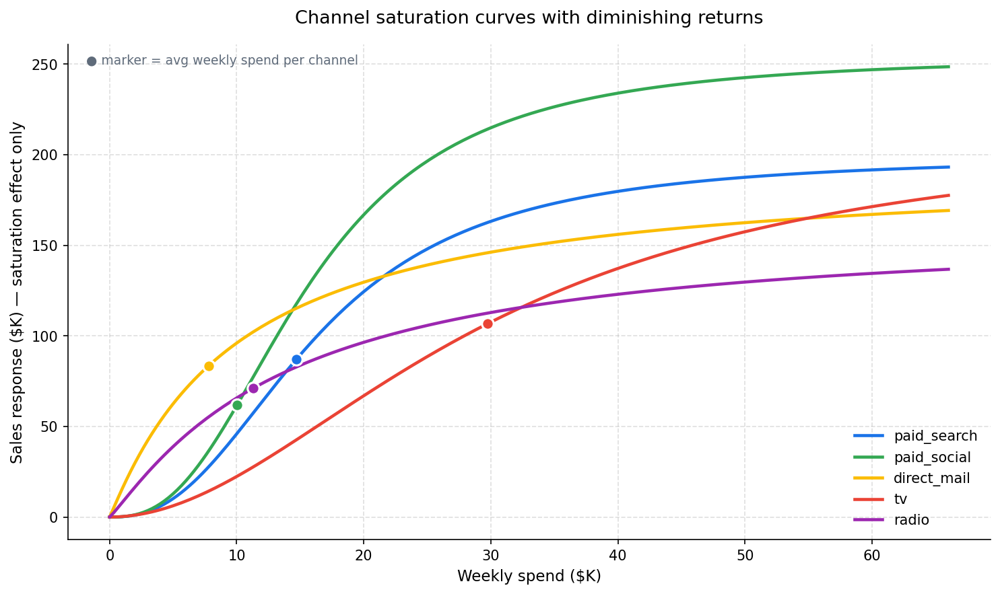
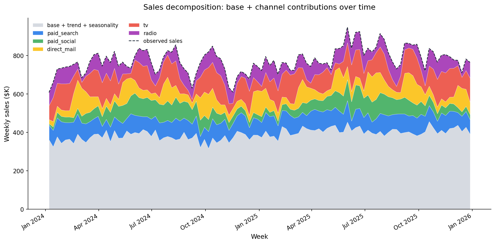
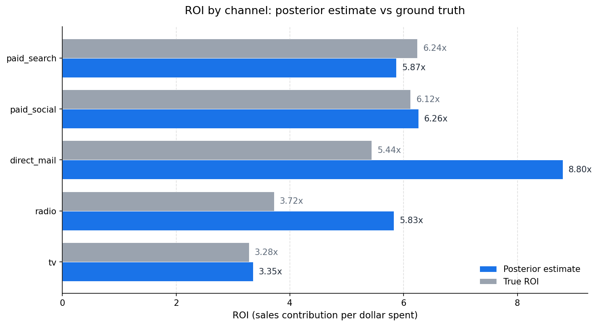
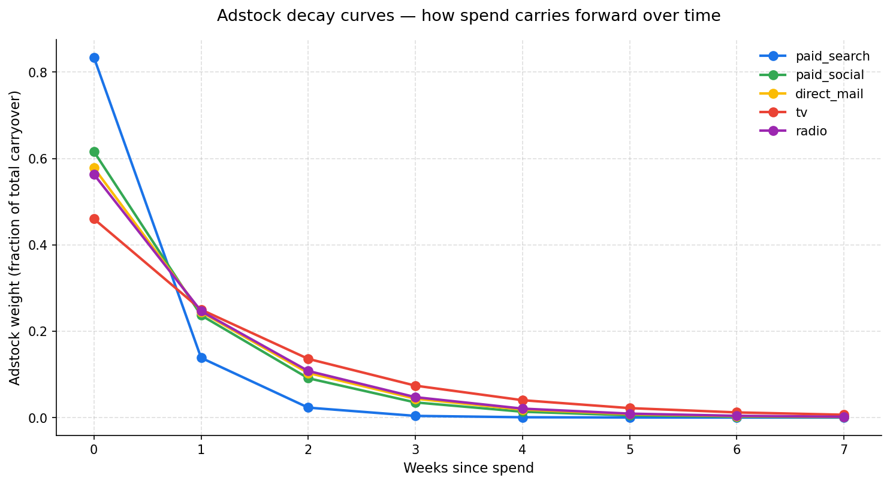

# Bayesian Marketing Mix Model (PyMC)

A Bayesian Marketing Mix Model implemented in [PyMC](https://www.pymc.io/), estimating the contribution of each marketing channel to sales with **adstock** (carryover effects) and **Hill saturation** (diminishing returns) applied per channel.

Originally built to quantify the dollar impact of paid search, paid social, direct mail, TV, and radio spend on revenue in a healthcare retail business — and to surface the diminishing-return point in each channel for budget reallocation decisions.

This portfolio version uses synthetic data with known true parameters, so the model's posterior estimates can be validated against ground truth.

## What this answers

> "If I spent another $10K on TV next week, what's the expected lift in sales? At what point does that lift stop being worth it? And how does that compare to spending $10K more on paid search?"

While [Markov attribution](../01_markov_attribution/) answers "which channels got credit for a conversion", MMM answers "what's the marginal return on each dollar of spend in each channel". The two methods are complementary: attribution credits past conversions, while MMM informs prospective spend decisions.

## Sample outputs


*Each channel has a distinct response curve. Direct mail (yellow) saturates quickly — adding more spend hits diminishing returns fast. TV (red) saturates slowly, meaning there's more room to scale. The ● markers show where each channel currently operates on its curve.*


*Stacked decomposition of weekly sales: base demand (gray), plus the contribution of each channel after adstock and saturation effects. The observed sales line (dashed black) closely tracks the model's predicted total — confirming the fit.*


*Posterior ROI estimates compared against the true ROI baked into the synthetic data. TV recovers excellently (3.35x vs 3.28x). Paid search and paid social land within ~5% of truth. Direct mail and radio are over-estimated — see "Limitations" below for why this is expected behavior, not a bug.*


*Paid search burns fast (~83% of impact in week 0), while TV carries forward for 4–5 weeks. Adstock-aware modeling captures these timing differences, which simple regressions on raw spend would miss.*

## Setup

```bash
# From the repo root, install dependencies
pip install -r ../requirements.txt
```

`pymc`, `arviz`, and `xgboost` add up to a ~500 MB install. Allow time. On Windows, if `pymc` fails to build, see the troubleshooting section at the bottom of this README.

```bash
# Generate synthetic weekly spend + sales data
python generate_synthetic_data.py

# Fit the MMM and produce outputs (~1–3 minutes on a typical laptop)
python run_analysis.py
```

The MCMC step is the slowest. Default config: 1000 draws, 1000 tune, 2 chains. Adjust in `run_analysis.py` if you want faster (smaller draws) or tighter (more chains, more draws) results.

## File structure

```
02_bayesian_mmm/
├── README.md                     # This file
├── generate_synthetic_data.py    # Synthetic weekly data generator
├── mmm_model.py                  # BayesianMMM class (PyMC implementation)
├── run_analysis.py               # End-to-end analysis pipeline
├── data/                         # Generated locally — not committed
│   ├── mmm_weekly_data.csv
│   └── true_parameters.csv
├── docs/                         # Showcase images for the README
│   ├── saturation_curves.png
│   ├── sales_decomposition.png
│   ├── roi_comparison.png
│   └── adstock_decay.png
└── output/                       # Full analysis outputs — not committed
```

## Methodology

### Model specification

For each week `t`:

```
sales_t = intercept
          + trend_coef · t
          + season_coef · sin(2π · t / 52 + phase)
          + Σ_c [ beta_c · Hill( Adstock(spend_{c, t}; decay_c); half_sat_c, slope_c ) ]
          + noise_t
```

where `Adstock` is a geometric carryover and `Hill` is the saturation curve.

### Adstock (carryover)

$$\text{Adstock}(s; \lambda) = \frac{1}{Z} \sum_{l=0}^{L-1} \lambda^l \, s_{t-l}$$

The decay rate `λ ∈ [0, 1]` controls how much of last week's spend still has impact this week. Paid search has low decay (clicks act immediately); TV has high decay (brand awareness persists for weeks).

### Hill saturation

$$\text{Hill}(x; h, s) = \frac{x^s}{h^s + x^s}$$

The Hill function captures diminishing returns: response rises quickly at low spend and plateaus as spend grows. `h` is the half-saturation point (spend at which response reaches 50% of maximum), and `s` controls the steepness of the curve.

### Priors

| Parameter | Prior | Rationale |
|---|---|---|
| `decay` | `Beta(2, 2)` | Bounded [0, 1], weakly informative |
| `half_sat` | `HalfNormal(σ=20)` | Positive, scale ~$K of weekly spend |
| `slope` | `HalfNormal(σ=2)` | Positive, typically 1–3 for marketing |
| `beta` | `HalfNormal(σ=150)` | Positive (marketing increases sales), wide |
| `intercept` | `Normal(μ=400, σ=100)` | Centered on plausible base sales |
| `trend_coef` | `Normal(μ=0, σ=2)` | Weakly informative trend |
| `season_coef` | `Normal(μ=0, σ=40)` | Weakly informative seasonal amplitude |
| `sigma` | `HalfNormal(σ=50)` | Observation noise |

### Inference

[NUTS](https://arxiv.org/abs/1111.4246) (No-U-Turn Sampler), 1000 draws × 2 chains after 1000 tune steps. `target_accept=0.95` to handle the funneled posterior geometry common in MMMs.

## Why this beats simple regression

| Aspect | OLS regression on raw spend | Bayesian MMM |
|---|---|---|
| Captures carryover | No — assumes weekly spend has no lag effect | Yes — adstock models weeks-long persistence |
| Captures diminishing returns | No — assumes linear response | Yes — Hill saturation models the plateau |
| Quantifies uncertainty | Point estimates only | Full posterior distribution per parameter |
| Handles small data well | Overfits with many channels | Priors regularize sensibly |
| Informs spend reallocation | Crudely (linear extrapolation) | Directly (the saturation curve shows where each channel saturates) |

## Limitations to be aware of

This is where most MMM tutorials gloss over the hard parts. Worth being explicit about:

1. **Parameter identifiability.** With 5 channels × 4 parameters each (20 channel parameters), 4 base/trend/seasonality parameters, and observation noise, on only 104 weeks of data, individual parameters within a channel can trade off against each other. In particular, `beta` and `slope` are correlated — high `beta` + steep saturation looks similar to low `beta` + gradual saturation when fitting the data. **The ROI estimates (channel-total contribution / channel-total spend) are more robust than individual parameter recovery.** In this synthetic run, TV recovers excellently, paid search and paid social recover well, but direct mail and radio over-estimate ROI because their spend patterns are sparse (campaigns / flighting), giving the model less variation to learn from.

2. **Spend variation matters.** A channel with very stable spend across time can't have its saturation curve identified. The model can only learn the curve if it observes spend at varying levels. This is why MMM practitioners design holdout tests with intentional spend variation.

3. **Confounding from external drivers.** This model includes trend and seasonality but not price changes, competitor spend, macroeconomic factors, or product launches. Real MMM implementations layer these as control variables. Omitted variable bias can show up as inflated channel effects when spend correlates with an unmeasured driver (e.g., higher TV spend during product launches will absorb credit for both).

4. **Adstock is a simplification.** Geometric adstock assumes a fixed decay rate per channel. Real-world response often has more complex shapes (e.g., delayed peaks for direct mail). [Weibull adstock](https://research.google/pubs/pub46001/) handles this better but adds two more parameters per channel.

5. **No incrementality without an experiment.** Even a well-identified MMM tells you correlation between spend and sales, conditioned on the assumed model structure. Causal identification requires either spend holdouts (geo-experiments) or instrumental variables. MMM is most useful as a continuously-updated planning tool, complemented by occasional incrementality tests.

## Reference reading

- Jin et al. (2017). "Bayesian Methods for Media Mix Modeling with Carryover and Shape Effects." *Google Research*. — the foundational reference for Bayesian MMM with adstock and Hill saturation.
- Chan & Perry (2017). "Challenges and Opportunities in Media Mix Modeling." *Google Research*. — honest treatment of identifiability and confounding.
- [pymc-marketing](https://github.com/pymc-labs/pymc-marketing) — PyMC Labs' production-grade MMM library. Worth referencing as the next step beyond a from-scratch implementation.

## Troubleshooting PyMC installation on Windows

If `pip install pymc` fails with a build error:

```bash
# Try installing without isolated build
pip install pymc --no-build-isolation

# Or use conda which handles the BLAS dependencies for you
conda install -c conda-forge pymc
```

If sampling fails with `ZeroDivisionError: integer division or modulo by zero` (a PyMC 6.0+ issue on some BLAS configurations), pass `cores=1` explicitly:

```python
mmm.fit(draws=1000, tune=1000, chains=2, cores=1)
```

The `run_analysis.py` script already does this by default.

## About this implementation

This portfolio version uses synthetic data generated by `generate_synthetic_data.py` with known true parameters. The model methodology, prior structure, adstock and saturation formulations, and visualization layer reflect a production deployment built to inform marketing budget allocation in a healthcare retail context, paired with multi-touch attribution to provide both prospective (MMM) and retrospective (Markov) views on channel value.
