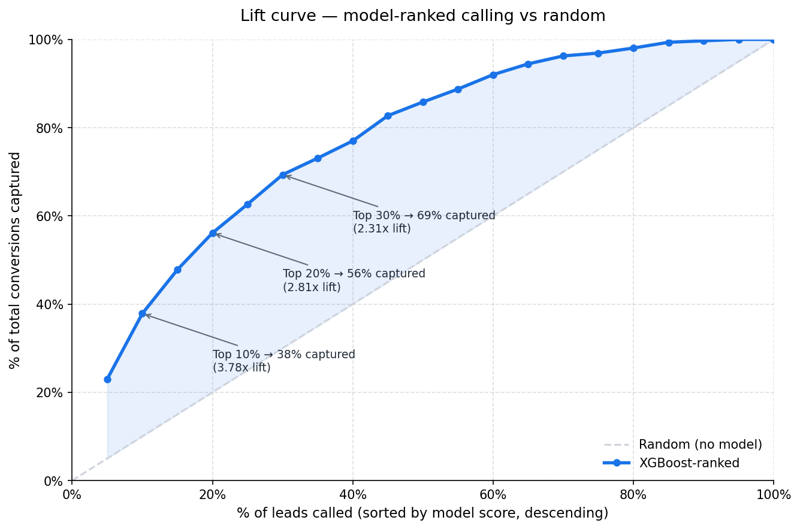
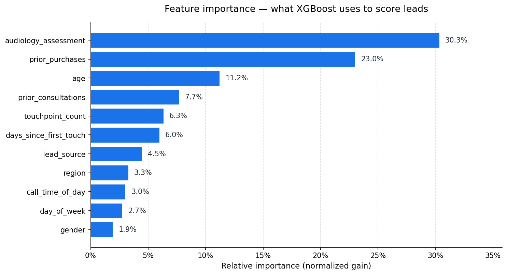
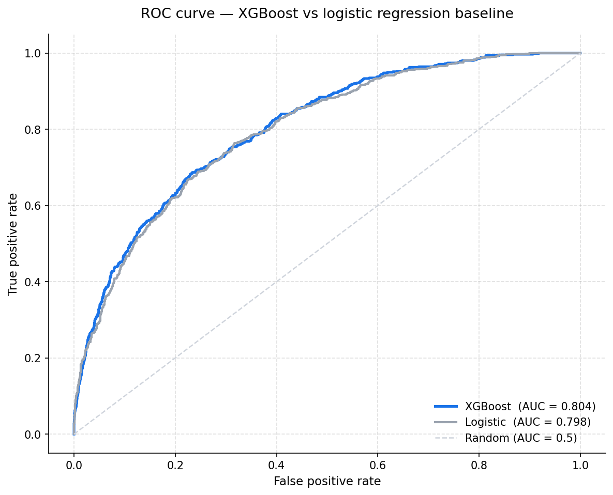
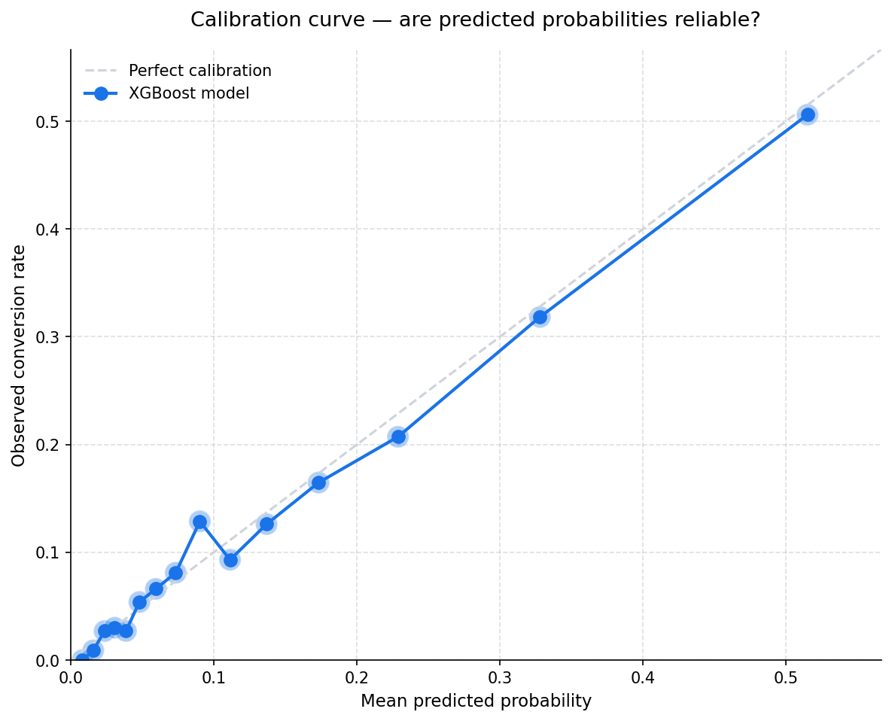

# XGBoost Lead Scoring

A gradient-boosted classifier that predicts the probability of inbound lead conversion, designed to support **call-center prioritization** when call capacity is the binding constraint. Originally built for an Amplifon Canada healthcare retail context (hearing aid consultations); this portfolio version uses synthetic data with the same feature structure.

## What this answers

> "We get more inbound leads than we have call-center capacity to follow up with. If we can only call 1,000 leads this week, which 1,000 should they be?"

This is the operational lead-scoring problem. Heuristic alternatives (call leads in chronological order, or call high-spend channels first) leave conversions on the table. A trained model that ranks leads by predicted conversion probability lets a constrained team capture more conversions with the same effort.

## Sample outputs


*If the call-center can handle the top 20% of inbound leads (1,000 of 5,000 in the test set), ranking by XGBoost score captures **56% of all conversions** — a **2.8x lift** vs calling leads in a random order. At top 10%, the lift rises to **3.8x**.*


*Audiology assessment severity and prior purchases drive the majority of model decisions, followed by age — consistent with the underlying healthcare retail context (older customers with diagnosed hearing loss and existing product history are the most likely converters).*


*XGBoost slightly outperforms logistic regression on AUC (0.804 vs 0.798). The bigger win shows up in calibration (Brier score 0.089 vs 0.184) — XGBoost's predicted probabilities can be used as-is for capacity planning; the class-balanced logistic regression's cannot.*


*The blue line tracks the diagonal closely: when the model predicts 20% probability of conversion, the actual conversion rate in that bin is ~20%. Calibrated probabilities matter because the operational decision ("call top X leads") depends on rank, but capacity planning ("how many conversions will we get") depends on the raw probabilities.*

## Setup

```bash
# From the repo root
pip install -r ../requirements.txt

# Generate the synthetic lead dataset (~25K leads)
python generate_synthetic_data.py

# Train the model, evaluate, and produce visualizations
python run_analysis.py
```

Total runtime: ~30 seconds. Much faster than Module 2's MMM because there's no MCMC sampling.

## File structure

```
03_lead_scoring/
├── README.md                       # This file
├── generate_synthetic_data.py      # Synthetic lead data generator
├── lead_scoring_model.py           # XGBoostLeadScorer + LogisticBaseline classes
├── run_analysis.py                 # End-to-end training, evaluation, visualization
├── data/                           # Generated locally — not committed
│   └── leads.csv
├── docs/                           # Showcase images for README
│   ├── lift_curve.png
│   ├── feature_importance.png
│   ├── roc_curves.png
│   ├── calibration_curve.png
│   └── score_distribution.png
└── output/                         # Full analysis outputs — not committed
```

## Methodology

### Features

Five categorical and five numeric features, all available at the time of inbound lead:

| Feature | Type | Description |
|---|---|---|
| `lead_source` | categorical | Channel that originated the lead (paid_search, paid_social, direct_mail, tv, organic, referral) |
| `audiology_assessment` | categorical | Hearing loss severity (none / mild / moderate / severe / profound) |
| `age` | numeric | Lead age in years |
| `gender` | categorical | M / F / Other |
| `region` | categorical | Canadian province |
| `prior_consultations` | numeric | Count of prior consultations with the brand |
| `prior_purchases` | numeric | Count of prior product purchases |
| `days_since_first_touch` | numeric | Recency of first interaction with the brand |
| `touchpoint_count` | numeric | Total marketing touchpoints to date |
| `call_time_of_day` | categorical | Morning / afternoon / evening |
| `day_of_week` | categorical | Weekday / weekend |

### Model

XGBoost classifier with native categorical feature support (`enable_categorical=True`), tuned for calibrated probability output rather than peak AUC:

| Hyperparameter | Value | Rationale |
|---|---|---|
| `n_estimators` | 400 (with early stopping at 25 rounds) | Plenty of capacity; early stopping prevents overfit |
| `max_depth` | 4 | Shallow enough to avoid overfit; deep enough for interactions |
| `learning_rate` | 0.05 | Conservative; works with the larger ensemble |
| `min_child_weight` | 20 | Stops splits on tiny leaf nodes |
| `subsample` / `colsample_bytree` | 0.85 / 0.85 | Mild regularization via row/column sampling |
| `reg_lambda` | 1.0 | L2 regularization on leaf weights |
| `scale_pos_weight` | *(not used)* | At 12% positive class, the imbalance isn't extreme enough to justify it; using it pushes predictions away from calibrated |

### Train / validation / test

60 / 20 / 20 stratified split on the `converted` outcome. The validation set drives early stopping; the test set is held out for all metrics reported in the README.

### Logistic regression baseline

A class-balanced logistic regression with one-hot encoded categoricals and standardized numerics is fit on the same training data. Its purpose is to quantify the marginal value of using XGBoost — if a much simpler model performs nearly as well, that's worth knowing.

In this run, XGBoost outperforms logistic on every metric, with the biggest margin on the **Brier score** (0.089 vs 0.184), reflecting much better-calibrated probabilities. The AUC delta is small (~0.6 points) because the underlying signal is mostly additive — most lift in tree-based methods over logistic comes from interaction effects, and the synthetic data here has only mild interactions baked in.

### Capacity-constrained operational metric

The metric leadership actually cares about is **capture rate at capacity**: "if our call-center can only call 20% of inbound leads, what % of conversions do we still get?"

For this dataset:

| Capacity | Leads called | Conversions captured | Capture % | Lift vs random |
|---|---|---|---|---|
| Top 5% | 250 | 141 | 23.0% | 4.6x |
| Top 10% | 500 | 232 | 37.8% | 3.8x |
| Top 20% | 1,000 | 344 | 56.1% | 2.8x |
| Top 30% | 1,500 | 425 | 69.3% | 2.3x |
| Top 50% | 2,500 | 526 | 85.8% | 1.7x |

Pick the capacity that matches your actual headcount, then read off the expected capture rate.

## Why this beats simpler alternatives

| Approach | Top 20% capture | Notes |
|---|---|---|
| **Random calling order** | ~20% | The "no model" baseline |
| **Call highest-source-rate leads first** | ~25-30% | Only uses one feature |
| **Logistic regression on all features** | ~55% | Strong baseline, but miscalibrated when class-weighted |
| **XGBoost (this model)** | **56%** | Slight edge in AUC, big edge in calibration |

The AUC edge of XGBoost over a well-built logistic baseline is genuinely small for problems where the underlying signal is mostly additive. The portfolio honesty here matters: **don't oversell the marginal AUC; sell the calibrated probabilities** (which matter for capacity planning) and the **operational lift at the actual decision point** (which matters for the call-center).

## Limitations to be aware of

1. **The model ranks well but doesn't explain conversion causally.** "Audiology severity is the top feature" doesn't mean increasing audiology severity causes conversions — it's that severe hearing loss is correlated with high intent to buy a hearing aid. Causal claims would require a randomized experiment.
2. **Selection bias risks.** The model is trained on leads that the business has historically chosen to score. If past calling decisions weren't random (e.g., the team already prioritized certain sources), the model learns those decisions, not the underlying conversion propensity. Production deployment requires either an unbiased training set or careful debiasing.
3. **Distribution shift.** Lead source mix, audience demographics, and competitive context all shift over time. The model needs periodic retraining — typically every 1-3 months for a healthcare retail context.
4. **Calibration isn't perfect.** The calibration curve is close to the diagonal but not exact. For high-stakes capacity planning, consider isotonic or Platt scaling on a holdout set to fully calibrate.
5. **Class imbalance is mild here (12% positive).** If positive class drops to ~1-2%, scale_pos_weight, focal loss, or oversampling become more relevant. The hyperparameter choices in this code assume the moderate imbalance present in this dataset.
6. **No fairness audit.** A production deployment in healthcare requires checking that score distributions are roughly equal across protected groups (e.g., gender, region) to avoid systematic under-prioritization. This implementation includes the data but doesn't enforce fairness constraints.

## Reference reading

- Chen & Guestrin (2016). "XGBoost: A Scalable Tree Boosting System." KDD 2016. — the original XGBoost paper.
- Niculescu-Mizil & Caruana (2005). "Predicting Good Probabilities with Supervised Learning." ICML 2005. — foundational treatment of calibration in classifiers.
- Saito & Rehmsmeier (2015). "The Precision-Recall Plot Is More Informative than the ROC Plot When Evaluating Binary Classifiers on Imbalanced Datasets." *PLoS ONE*. — why PR-AUC matters alongside ROC-AUC for lead scoring.

## About this implementation

This portfolio version uses synthetic data generated by `generate_synthetic_data.py` with a latent log-odds model so the feature signals are known and the model can be evaluated against ground-truth structure. The methodology, model architecture, evaluation pipeline, and operational interpretation reflect a production deployment built to inform call-center routing decisions in a healthcare retail context.
