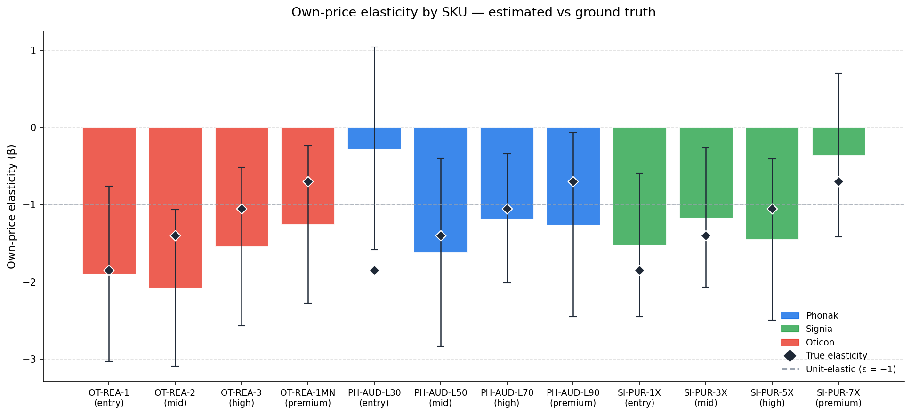
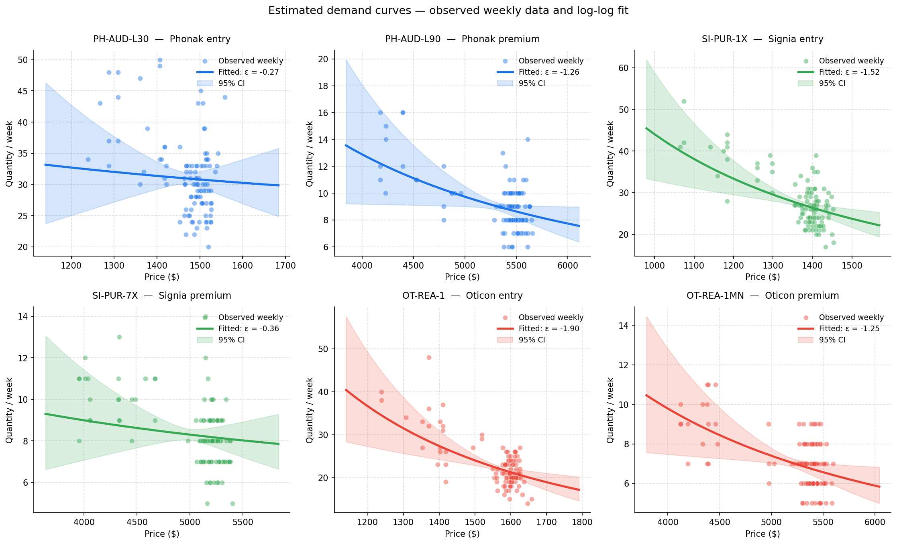
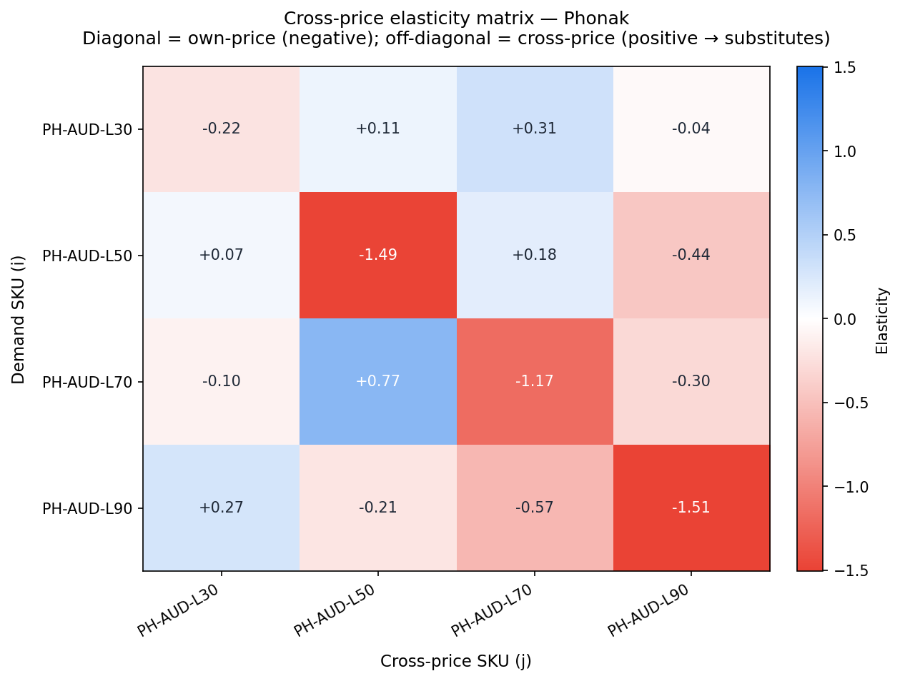
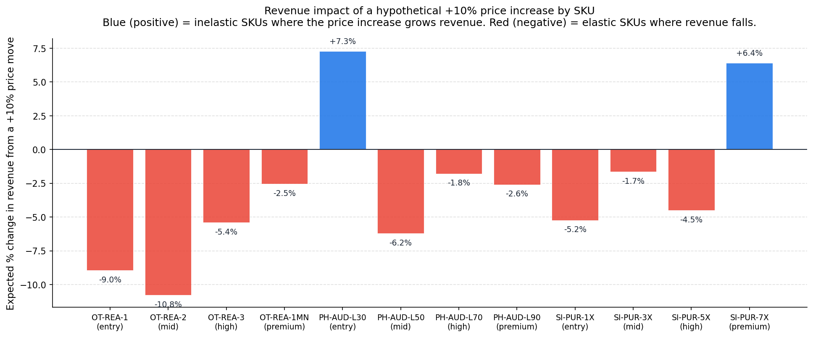

# Price Elasticity & Demand Curves

Estimates **own-price elasticity** per SKU using log-log OLS regression, plus **within-brand cross-price elasticity** matrices for substitution analysis, across a healthcare retail (hearing aid) portfolio. Originally built on 24 months of SKU-level transaction data at Amplifon Canada; this portfolio version uses synthetic data with known true elasticities for validation.

## What this answers

> "If we raise the price of our premium hearing aid by 10%, what happens to unit sales and total revenue? Which SKUs can absorb a price increase, and which ones would lose more volume than the price gain is worth? And when we discount one model, how much of the lift is just cannibalizing our other models?"

These are the core pricing questions. Elasticity tells you the volume response to a price change; the sign of `(1 + elasticity)` tells you whether revenue rises or falls; and the cross-price matrix tells you how much a promotion on one SKU steals demand from your own shelf.

## Sample outputs


*Estimated elasticities (bars) vs ground truth (diamonds), with 95% confidence intervals. The broad pattern is recovered — entry and mid SKUs are more elastic (steeper price sensitivity) than premium SKUs. The wide confidence intervals are honest: with limited price variation outside promotional weeks, individual SKU elasticities carry real uncertainty.*


*Fitted demand curves for entry and premium SKUs across all three brands. The dense cluster of points at regular price plus the spread during promotional weeks is what drives identification — a SKU whose price never moves can't have its elasticity estimated.*


*Within-brand substitution. The diagonal holds own-price elasticities (negative — own price up, own demand down). Positive off-diagonal cells indicate substitutes — when a sister SKU's price rises, this SKU picks up demand. This matrix informs how much a promotion cannibalizes the rest of the brand's lineup.*


*Translating elasticity into the revenue decision. Blue bars are inelastic SKUs (|ε| < 1) where a price increase grows revenue; red bars are elastic SKUs where the volume loss outweighs the price gain. The rule: % revenue change ≈ (1 + ε) × % price change.*

## Setup

```bash
# From the repo root
pip install -r ../requirements.txt

# Generate the synthetic SKU-level transaction data
python generate_synthetic_data.py

# Fit elasticity models and produce visualizations
python run_analysis.py
```

Total runtime: ~10 seconds (OLS is fast — no MCMC like the MMM module).

## File structure

```
04_price_elasticity/
├── README.md                       # This file
├── generate_synthetic_data.py      # Synthetic SKU-level data generator
├── elasticity_model.py             # Log-log OLS elasticity + cross-price models
├── run_analysis.py                 # End-to-end analysis pipeline
├── data/                           # Generated locally — not committed
│   ├── transactions.csv
│   └── true_elasticities.csv
├── docs/                           # Showcase images for README
│   ├── elasticity_comparison.png
│   ├── demand_curves.png
│   ├── cross_elasticity_phonak.png
│   ├── revenue_impact.png
│   └── promotional_lift.png
└── output/                         # Full analysis outputs — not committed
```

## Methodology

### The log-log specification

For each SKU, demand is modeled as:

```
log Q_i,t = α_i + β_i · log(P_i,t) + γ_i · log(P_sister_avg,t)
                + δ_i · promo_i,t + season(t) + ε_i,t
```

The key property of the log-log form is that **the coefficient β is the elasticity directly**: a 1% change in price produces a β% change in quantity demanded. No transformation needed. This is why log-log is the workhorse specification for elasticity estimation.

| Term | Meaning |
|---|---|
| `β_i · log(P_i,t)` | Own-price effect — the elasticity of interest |
| `γ_i · log(P_sister_avg,t)` | Within-brand competitor control — prevents own-price bias when sister SKUs are simultaneously discounted |
| `δ_i · promo_i,t` | Promotional lift beyond pure price (advertising, end-cap display, halo) |
| `season(t)` | Fourier seasonality (sin/cos on week-of-year) |

### Why include the sister-brand price control?

If you regress quantity on own-price alone, and your promotions tend to run brand-wide (multiple SKUs discounted together), the own-price coefficient absorbs some of the cross-SKU substitution effect — biasing the elasticity estimate. Including the average sister-SKU price as a control isolates the own-price response. This is a small but important specification choice.

### Cross-price elasticity matrix

For each ordered pair (i, j) within a brand, a separate regression of `log Q_i` on both `log P_i` and `log P_j` recovers the cross-price elasticity β_ij. A positive β_ij means SKUs i and j are substitutes (j gets more expensive → i picks up demand); a negative value would indicate complements. For a single-brand hearing aid lineup, we expect substitutes — and the matrix mostly shows that.

### Revenue and pricing logic

Because revenue R = P × Q, and in log-log form `log R = log P + log Q = (1 + β) log P + constant`, the elasticity of revenue with respect to price is simply `(1 + β)`:

- **Inelastic (|β| < 1):** `(1 + β) > 0` → raise price to grow revenue
- **Unit-elastic (β = −1):** revenue is locally flat to price
- **Elastic (|β| > 1):** `(1 + β) < 0` → cut price to grow revenue

This is why the revenue chart cleanly splits into "raise price" (blue) and "cut price" (red) SKUs.

## Results from this synthetic run

The model recovers the broad elasticity structure correctly:

| Tier | True elasticity | Recovered range | Pattern |
|---|---|---|---|
| Entry | −1.85 | −0.27 to −1.90 | Mostly elastic, one noisy estimate |
| Mid | −1.40 | −1.17 to −2.08 | Recovered around truth |
| High | −1.05 | −1.18 to −1.54 | Slightly over-estimated magnitude |
| Premium | −0.70 | −0.36 to −1.26 | Directionally inelastic, varies |

The premium SKUs are the least elastic, consistent with the well-established finding that premium buyers are less price-sensitive. The tier ordering (entry more elastic than premium) is broadly preserved, which is the result that actually drives pricing strategy.

## Limitations to be aware of

Pricing analytics has a long list of ways to go wrong. Being explicit:

1. **Identification depends on price variation.** A SKU whose price barely moves (few promotions, stable regular price) has a poorly identified elasticity — note the wide confidence intervals on some SKUs, and PH-AUD-L30 in this run, whose CI spans zero. You cannot estimate the slope of a demand curve from a single price point. Real elasticity studies design deliberate price tests for exactly this reason.
2. **Endogeneity / simultaneity.** Price and quantity are jointly determined — retailers raise prices when they anticipate high demand, which biases naive OLS toward inelastic estimates. The clean fix is an instrument (e.g., cost shocks, competitor-driven price changes) or experimental price variation. This implementation uses promotional price changes as a quasi-experimental source of variation but does not formally instrument.
3. **Log-log assumes constant elasticity.** Real demand curves bend — elasticity often differs at low vs high prices. A constant-elasticity model is a local approximation; extrapolating far from observed prices is unreliable.
4. **Promotional confounding.** Promotions bundle price cuts with advertising and display. The promo dummy partially separates these, but if advertising intensity isn't measured directly, the price coefficient can still absorb some advertising lift.
5. **No competitive reaction.** This models own and within-brand cross-price effects but doesn't capture how rival manufacturers respond to a price move. A price increase that triggers a competitor's promotion will show a worse real-world outcome than the static elasticity predicts.
6. **Cross-price matrix is noisy.** With ~104 weeks per SKU and limited independent price variation, the off-diagonal cross-price estimates carry substantial uncertainty. Treat the matrix as directional (who substitutes for whom) rather than precise point estimates.

## Reference reading

- Train (2009). *Discrete Choice Methods with Simulation.* — the canonical text on demand estimation, including the endogeneity problem.
- Berry, Levinsohn & Pakes (1995). "Automobile Prices in Market Equilibrium." *Econometrica.* — the foundational treatment of price endogeneity in demand estimation (the BLP model).
- Nevo (2001). "Measuring Market Power in the Ready-to-Eat Cereal Industry." *Econometrica.* — a clear applied example of estimating own- and cross-price elasticities across a product portfolio.

## About this implementation

This portfolio version uses synthetic data generated by `generate_synthetic_data.py` with known true elasticities baked in by tier, so the recovered estimates can be validated against ground truth. The log-log specification, sister-brand control, cross-price matrix, revenue logic, and promotional-lift decomposition reflect a production pricing-analytics workflow built to inform tier-level pricing and promotional-depth decisions in a healthcare retail context.

This module is methodologically distinct from the [Ridge-regression elasticity engine](https://github.com/FadiSalameh92) built for P&L line-item elasticities — that engine focuses on regularized estimation across multi-segment financial hierarchies with a full diagnostics suite, while this module focuses on consumer SKU-level demand curves, cross-price substitution, and revenue-optimal pricing direction.
