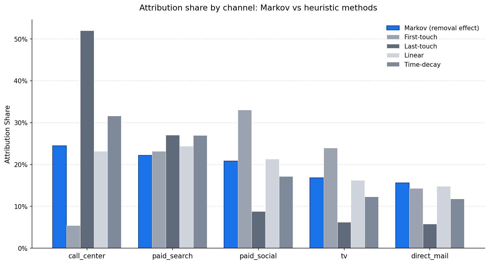
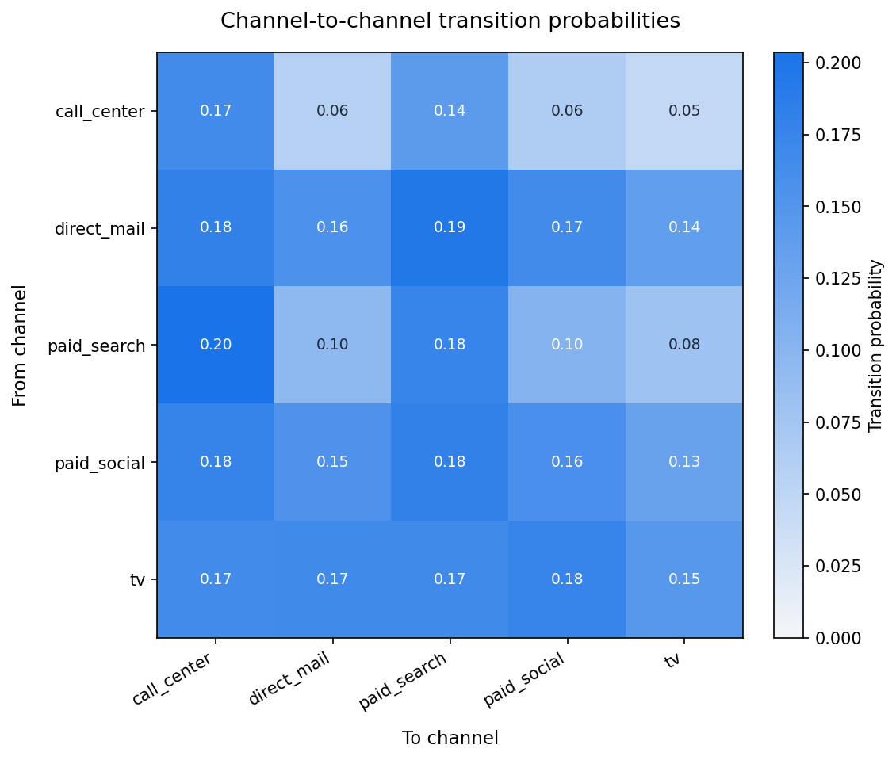

# Marketing Analytics Toolkit

A portfolio of four production-grade marketing analytics methods, each implemented as a standalone module with synthetic data, methodology documentation, and reproducible outputs.

Built originally across the marketing analytics function of a multi-channel consumer healthcare retail business. This portfolio version uses synthetic data, the methodology and code structure mirror the production deployments.

## Modules

| # | Module | Method | Status
|---|---|---|---|
| 1 | [Markov Chain Attribution](01_markov_attribution/) | First-order Markov chain with removal-effect attribution; comparison against four heuristic baselines | Live
| 2 | [Bayesian Marketing Mix Model](02_bayesian_mmm/) | PyMC-based MMM with channel adstock and saturation curves | Live
| 3 | [Lead Scoring with XGBoost](03_lead_scoring/) | Gradient-boosted classifier on demographic, behavioral, and prior-interaction features | Live
| 4 | [Price Elasticity & Demand Curves](04_price_elasticity/) | Log-log regression with elasticity estimation on SKU-level transaction data | Live

## What these methods answer together

Each module solves a different question in the marketing function:

- **Attribution**: When a customer converts, which channels caused it? *Module 1: Markov*
- **Spend efficiency**: How much extra revenue does each additional dollar in each channel produce? *Module 2: Bayesian MMM*
- **Lead prioritization**: Which inbound leads are most likely to convert, and how should we route them? *Module 3: XGBoost*
- **Pricing**: How sensitive is demand to price changes by SKU, and where can margin be expanded? *Module 4: Elasticity*

Modules 1 and 2 are complementary: Markov attributes credit across channels, while MMM quantifies the diminishing return on spend within each channel. In production, both feed into the same budget allocation decision.

## Sample outputs


*Markov attribution vs four heuristic baselines. Last-touch attribution indicates call_center drives 52% of conversions and TV drives 6%. Markov shows the real distribution is much more balanced (24.5% vs 16.9%) once channel interdependencies are accounted for.*


*Channel-to-channel transition probabilities surface the funnel structure: paid_search → call_center is the strongest transition path, while TV transitions broadly to all channels (consistent with its awareness-channel role).*

## Setup

```bash
# Clone the repo
git clone https://github.com/FadiSalameh92/marketing-analytics-toolkit.git
cd marketing-analytics-toolkit

# Install all dependencies
pip install -r requirements.txt

# Run any individual, self-contained module
cd 01_markov_attribution
python generate_synthetic_data.py
python run_analysis.py
```

Each module has its own README with setup instructions, methodology notes, and sample outputs.

## Project structure

```
marketing-analytics-toolkit/
├── README.md                       # This file
├── requirements.txt                # Combined dependencies for all modules
├── .gitignore
├── 01_markov_attribution/          # ✅ Multi-touch attribution
│   ├── README.md
│   ├── generate_synthetic_data.py
│   ├── markov_attribution.py
│   └── run_analysis.py
├── 02_bayesian_mmm/                # 🚧 Bayesian MMM (PyMC)
├── 03_lead_scoring/                # 🚧 XGBoost lead scoring
└── 04_price_elasticity/            # 🚧 Pricing elasticity models
```

## Stack

- **Python 3.10+**
- **pandas, numpy** Data Manipulation
- **scikit-learn** Classical ML and Preprocessing
- **statsmodels** Regression and Statistical Methods
- **PyMC** Bayesian Inference (Module 2)
- **XGBoost** Gradient Boosting (Module 3)
- **matplotlib** Visualization

## License

MIT
